# Fitting synthetic dataset (insulator)
**A synthetic dataset of 10,800 porcelain insulators.  Of course, you can generate any other synthetic dataset from the source code**

https://user-images.githubusercontent.com/86902173/170303802-042a10d8-8273-433a-a4e1-d22b4663bf4b.mp4

**<Example_Annotations>**  : Annotations example of  synthetic dataset   
**<Example_JPEGImages>**  : Image example of  synthetic dataset   
**<test_visio>**  : Some test videos and images   

10800 synthetic datasets download address

For all datasets, please refer to the following link of Baidu network disk：链接: https://pan.baidu.com/s/1ZqgdeP9uLoBM_-UkHTeg6A  密码: 1545

Some results of recognizing real images with YOLOX models trained using synthetic datasets

For more images please refer to the folder: test_visio/text_img/xxx.jpg    
  
  
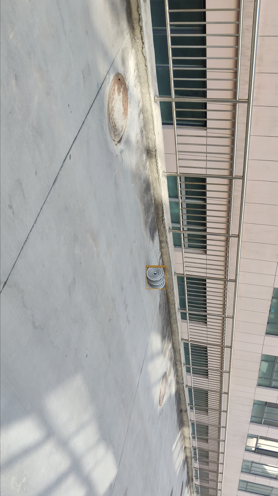  
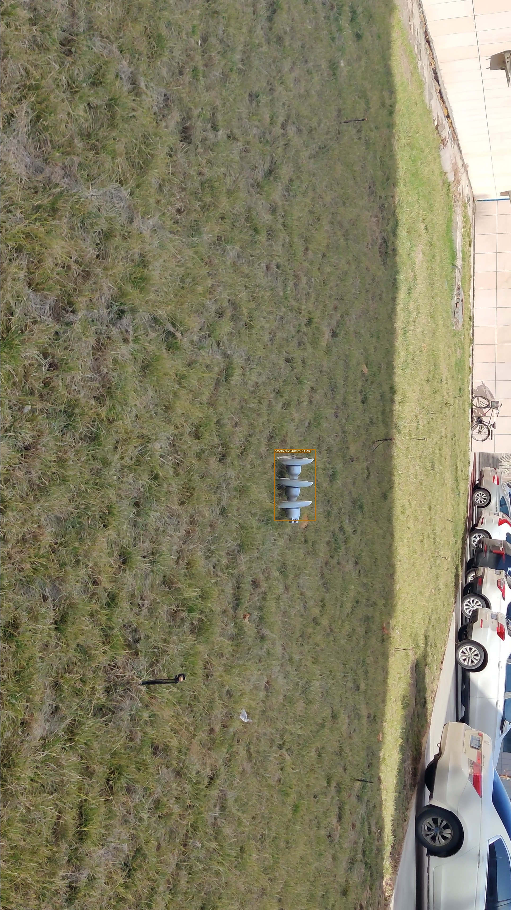
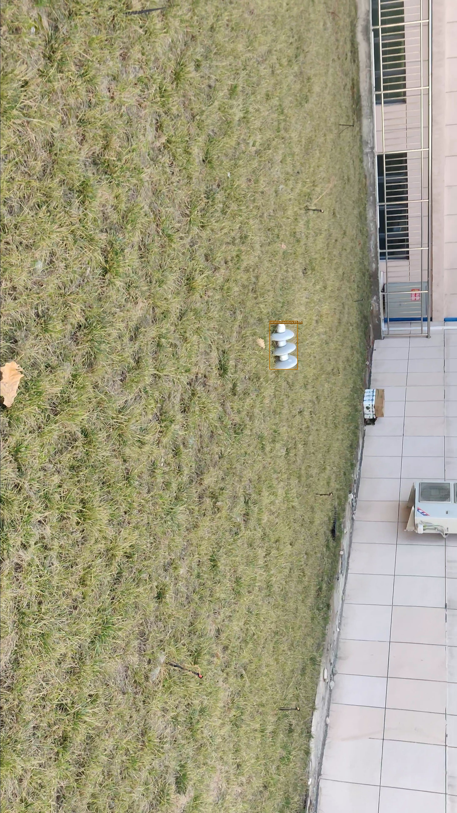
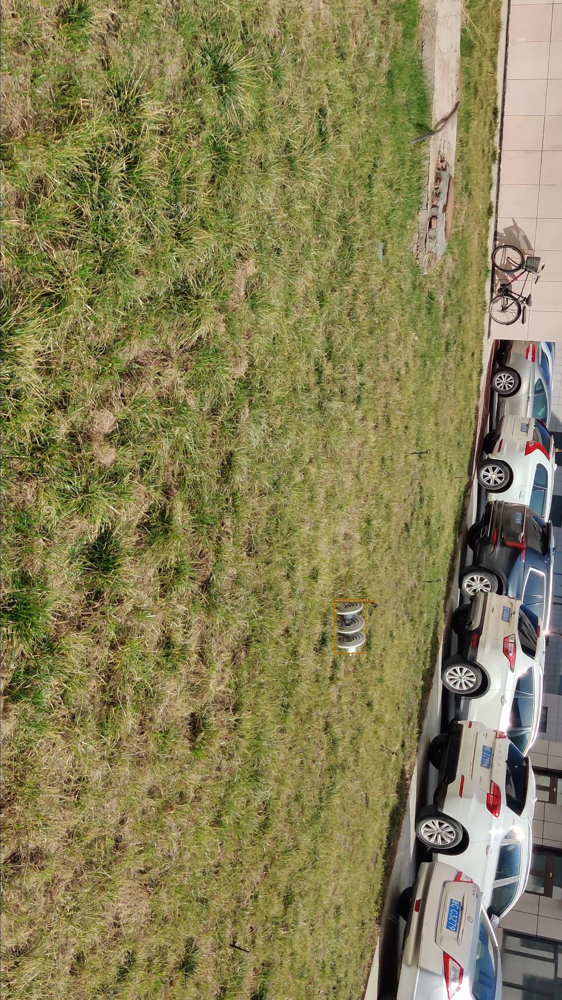
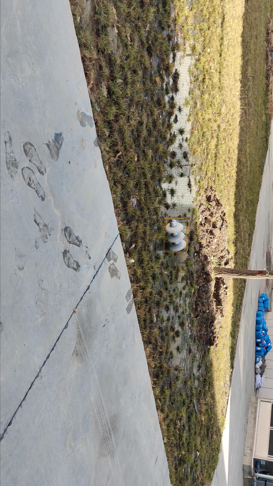
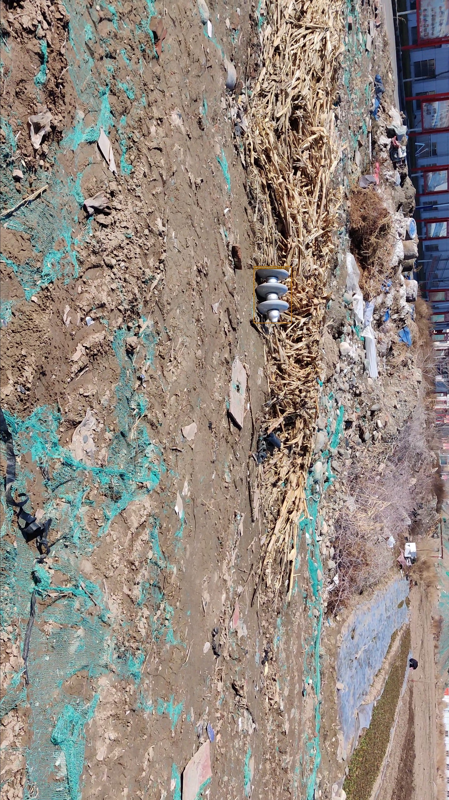

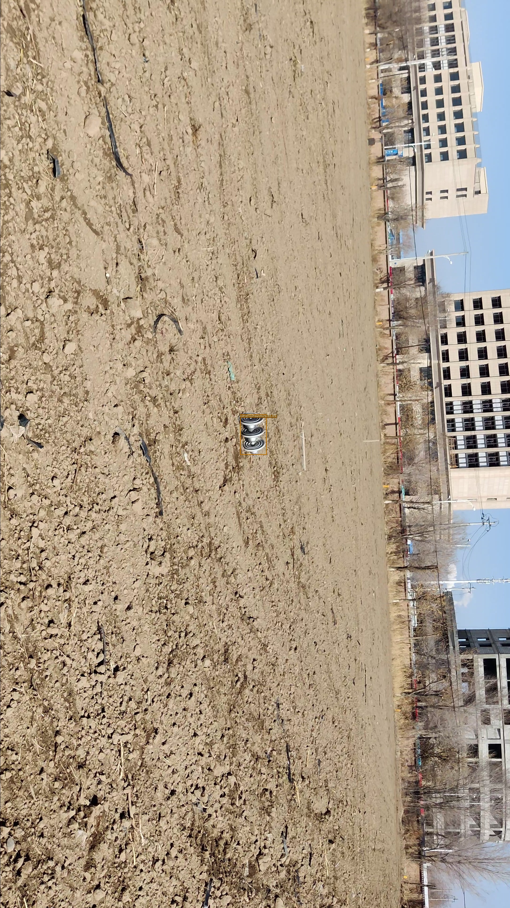
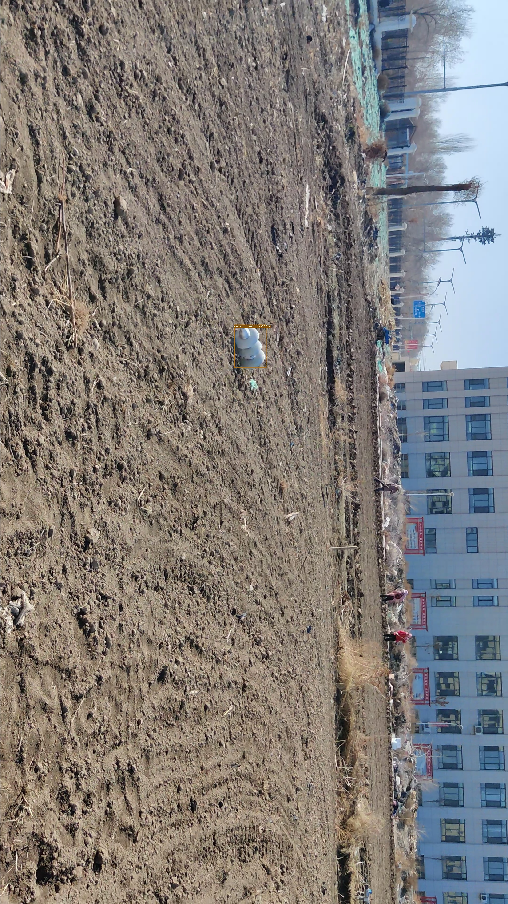
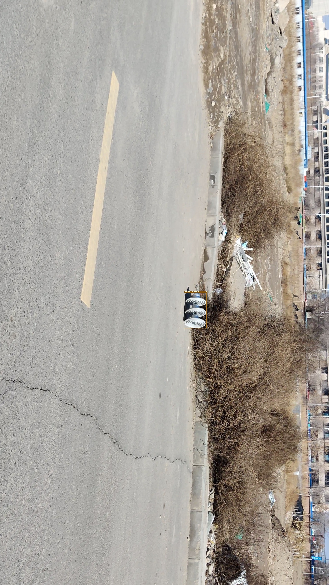
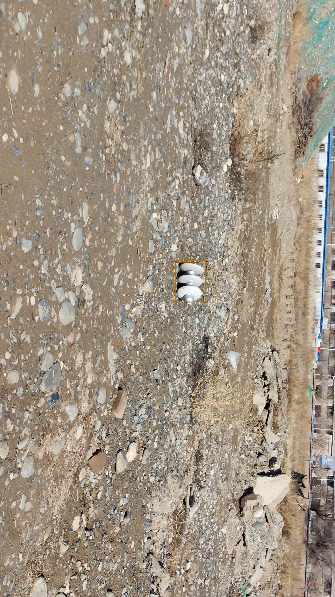
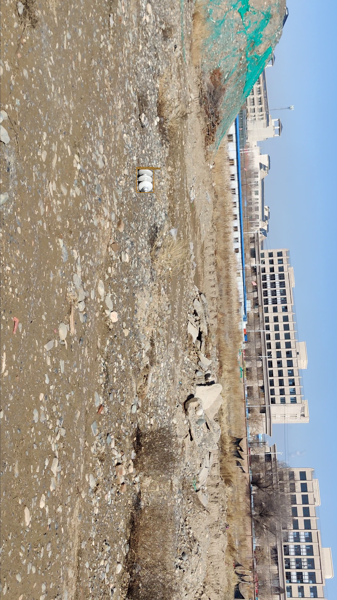

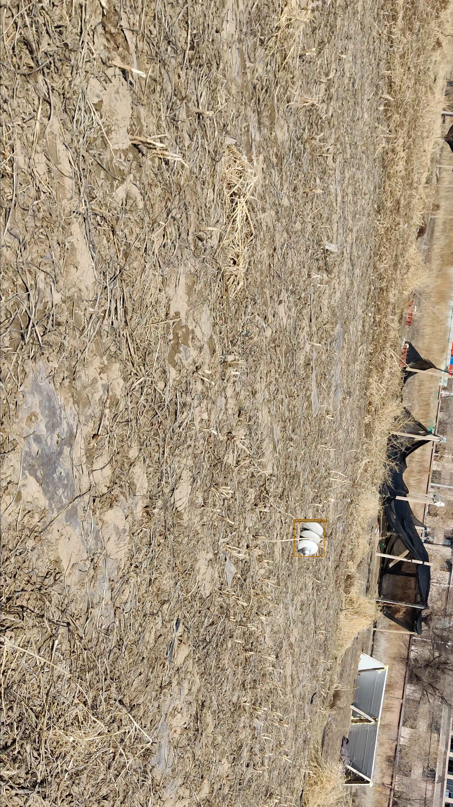

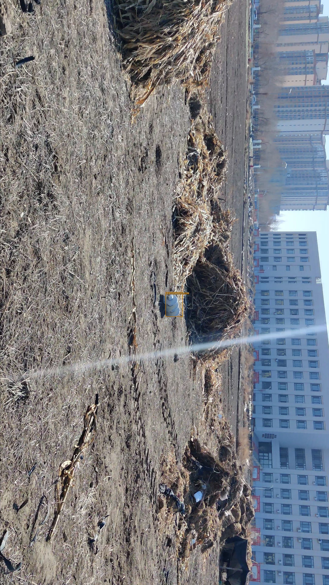
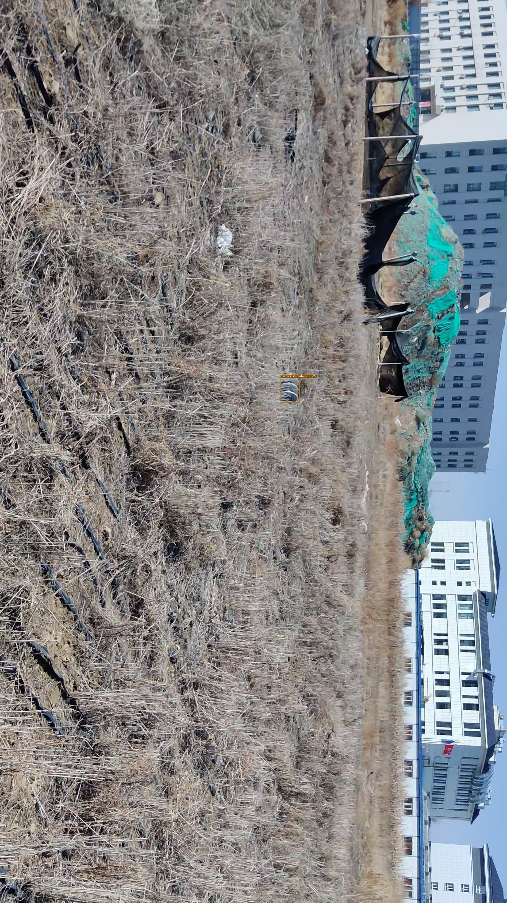
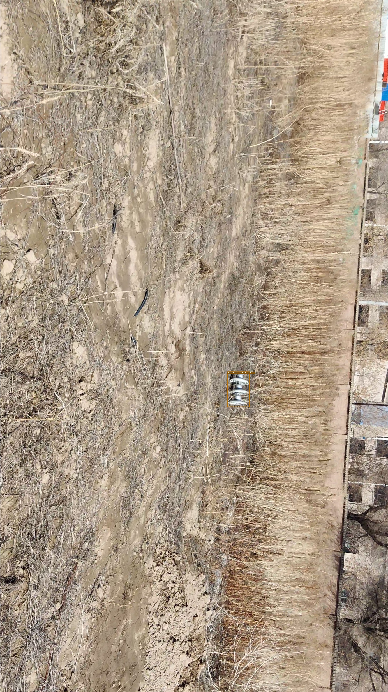
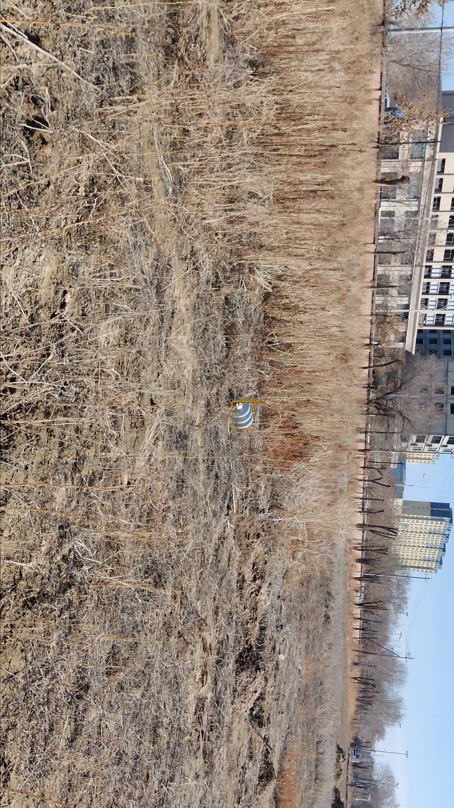
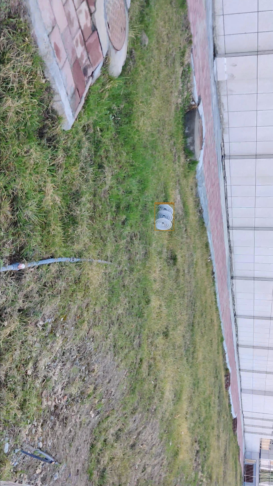
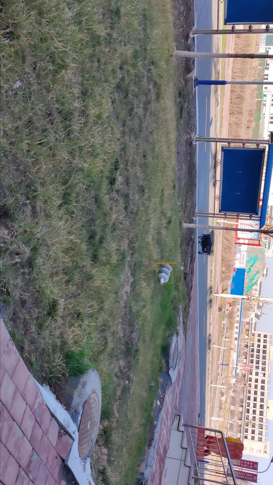

**Awaiting update**: depth maps and instance segmentation labels
