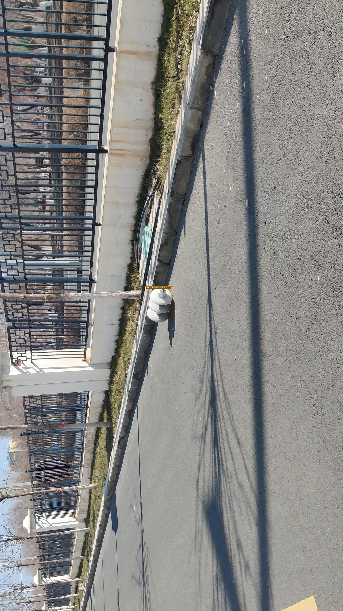

# Fitting synthetic dataset (insulator)
A synthetic dataset of 10,800 porcelain insulators.  Of course, you can generate any other synthetic dataset from the source code

For all datasets, please refer to the following link of Baidu network disk：链接: https://pan.baidu.com/s/1ZqgdeP9uLoBM_-UkHTeg6A  密码: 1545


<details>
<summary>123</summary>

```java


```
</details>

